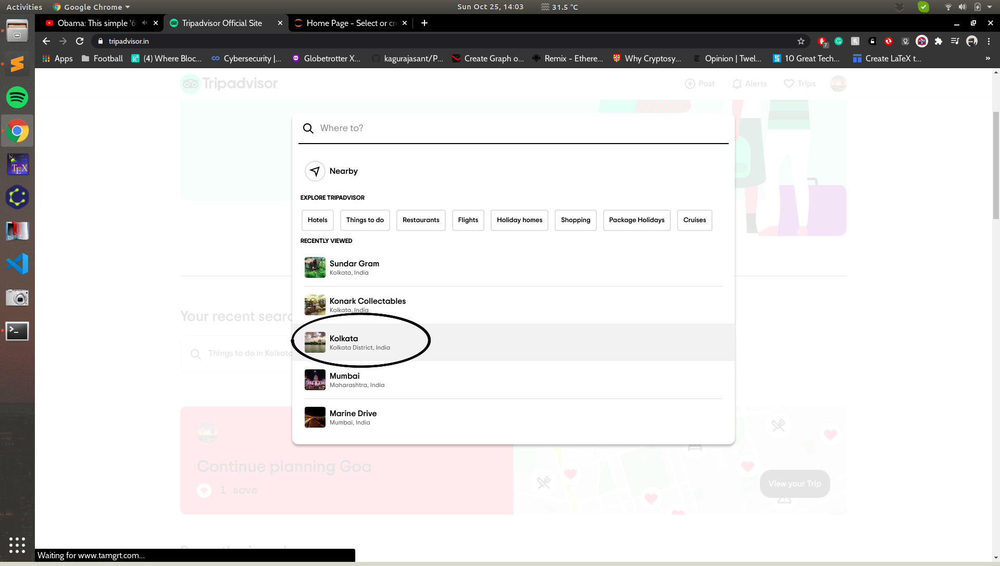
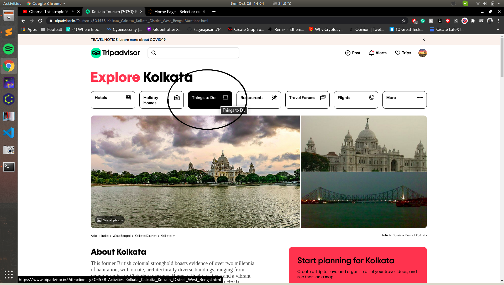
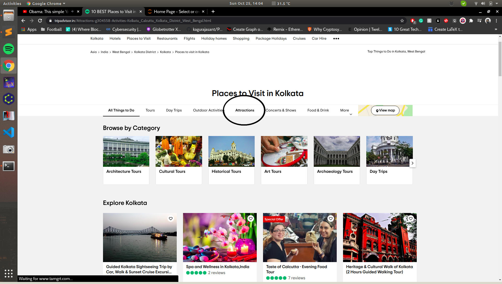
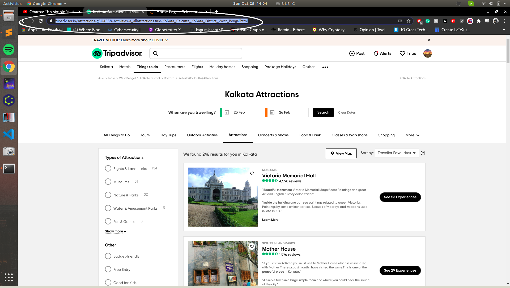

###Step 1: 

Look up the city on Tripadvisor.

### Step 2:

Select "Things to Do".

### Step 3:

Select "Attractions".

### Step 4:

The URL of this page is what we require. In the following image, the URL https://www.tripadvisor.in/Attractions-g304558-Activities-a_allAttractions.true-Kolkata_Calcutta_Kolkata_District_West_Bengal.html is what we require.

### Step 5:

Use the python script in the following manner (the number of pages and URL are the arguments):

python3 Attraction_extract.py 3 https://www.tripadvisor.in/Attractions-g304558-Activities-a_allAttractions.true-Kolkata_Calcutta_Kolkata_District_West_Bengal.html